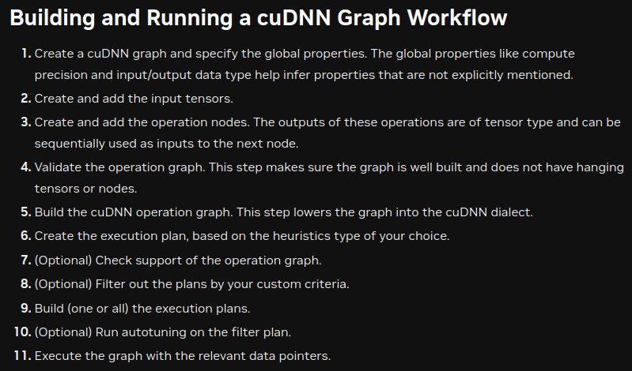

# cuBLAS

`cublasCreate()`

```cpp
cublasStatus_t
cublasCreate(cublasHandle_t *handle)
```

Resources on the host and device and must be called prior to making any other cuBLAS library calls.

`cublasDestroy()`

```cpp
cublasStatus_t
cublasDestroy(cublasHandle_t handle)
```

- `cublasSetWorkspace()`
*This function sets the cuBLAS library workspace to a user-owned device buffer, which will be used to execute all subsequent calls to the cuBLAS library functions (on the currently set stream). If the cuBLAS library workspace is not set, all kernels will use the default workspace pool allocated during the cuBLAS context creation. In particular, this routine can be used to change the workspace between kernel launches. The workspace pointer has to be aligned to at least 256 bytes, otherwise CUBLAS_STATUS_INVALID_VALUE error is returned. The cublasSetStream() function unconditionally resets the cuBLAS library workspace back to the default workspace pool. Too small workspaceSizeInBytes may cause some routines to fail with CUBLAS_STATUS_ALLOC_FAILED error returned or cause large regressions in performance. Workspace size equal to or larger than 16KiB is enough to prevent CUBLAS_STATUS_ALLOC_FAILED error, while a larger workspace can provide performance benefits for some routines. Recommended size of user-provided workspace is at least 4MiB*

So 4MB is recommended as the minimum to alloc on the device for the workspace

## cuBLASLt

This API exposes lower level cuBLAS operations, which offers more freedom on how compose the GEMM and epilogue of it.

**From the doc:**
*"ReLU, dReLu, GELU, dGELU and Bias epilogue modes (see CUBLASLT_MATMUL_DESC_EPILOGUE in cublasLtMatmulDescAttributes_t) are not supported when D matrix memory order is defined as CUBLASLT_ORDER_ROW. For best performance when using the bias vector, specify beta == 0 and CUBLASLT_POINTER_MODE_HOST."*

So to use any pointwise epilogue, D is required to be col-major,


# CUDA

To use asyncronous functions, like memcopy is needed to allocate pinned memory on the Host with: `cudaMallocHost`(work as the norma cudaMalloc)

## Shared Memory

Sahred memory is used for achieving better mem access. Remember:
- is limited to block scope (or see grid shared mem but its an advanced featrure)
- is limited in size (160 KB more or less)
- need to be allocated with a fixed size (so like with a DEFINE or something similar) or need to be allocated through the `extern`.

> [!Warning] Extern
> Keyword, but have some special features, like all the variables declared with it **starts with the same address**, the size **have to be specified at launch time** and "Note that pointers need to be aligned to the type they point to." --> float 4 bytes doesn't work with 3 long strides.

## CudaGraph
This is a tool that permits the creation of a *graph* that is composed by a series of operations to be launched sequentially or parallely on the device.
This can be a resource for optimizing the performance due to the reduced CPU overhead present in normal acceleration flow. CudaGraph launches kernels directly from the device, avoiding sometimes useless Host/Device synchronizations.

To use it, there are two methods, but in CUDA 11 or more is tipically recommended to use the **capture tool**. Which memorizes every op done in the capture section and create the graph form it.
Obviously this come to an overhead to the standard ops, so If the graph is not launched many times there will not be any improvements in performance, probably some degradation.

> [!Warning] 
> Is important to not modify (or modify the least possible) the device buffers(pointers) used during the Graph capture, this because the capture tool memorizes the pointers used for each op and reuse those, if their location change or are freed is not gonna work.

The graph need to be on a stream, so any CUDA OPERATION THAT SINCRONIZE THE DEVICE ARE NOT ALLOWED AND WILL CAUSE CORE DUMP.

## `volatile`

# cuDNN

## MULTI-HEAD-ATTENTION through FE API cuDNN 8.9.2

1. Create and populate the `attention_descriptor`
   1. `cudnnCreateAttnDescriptor`
   2. `cudnnSetAttnDescriptor`
2. Get the buffers `cudnnGetMultiHeadAttnBuffers`
3. Prepare the (single)weights buffer 
4. Populate the weigths buffer and tell cuDNN the address + shape of each weight type (Q,K,V,O and also biases)
   1. `cudnnGetMultiHeadAttnWeights` return the sub pointers to the weight buffer for each weigth type
   2. `cudnnGetTensorNdDescriptor` for getting the dimensions of the point 1 set tensor and know the size to cpy in memory
   3. `cudaMemCpy` for copying the data from the host(or device) to the sub part of the weight buffer
5. Create and set the sequence tensors for Q,K,V,O and biases
   1. `cudnnCreateSeqDataDescriptor`
   2. `cudnnSetSeqDataDescriptor`
6. Call the forward 
   1. `cudnnMultiHeadAttnForward`

## BACKEND API
General Rules:

1. EVERYTHING IS A DESCRIPTOR
2. EACH DESCRIPTOR HAS A LIST OF ATTRIBUTES THAT NEED TO BE  CREATED THEN SET/CAN BE SET 
3. ONCE SET EVERYTHING YOU FREEZE THE DESCRIPTORS
4. THE BYTE ALIGNEMENT IS IMPORTANT, TYPICALLY TAKING SMALL VALUES (2,4) WILL LED TO NOT SUPPORTED ENGINES


### 1-Tensors and Operations
First thing to do, after cudnn initialization, is creating the descriptors for every tensor and operation involved. 

Composing a multi node Operational Graph is suggested for cases in which fusion engines are available, but different considerations have to be made to let that happen:
1. There are limitations on the mathematical precision and I/O data type
2. There are requirements on the layout of the data
3. Every Tensor has to be associated to a UID's, `but the intermediate results of the operations, have to be virtual(?)`

### 2-Graph
The graph is the "graph" of operations to run, that you have defined.
Generating the graph is the last step before NVIDIA setups, heuristics and executions.
A graph need at least:
1. A cudnn handle
2. An array with all the operations(descriptors!) to run.

### 3-Engine
The engine executes the graph, we need to at least:
1. Define the Engine passing the freezed graph
2. The global index
3. Define an Engine configuration

**Engine Configuration**
"Engine classes cuDNN groups engines into four classes: *pre-compiled single-op engines*, *generic runtime-fusion engines*, *specialized runtime-fusion engines*, and *specialized pre-compiled fusion engines*. Example: the pre-compiled ConvolutionFwd engine."

#### Performance Knobs
"cudnnBackendKnobType_t is an enumerated type that indicates the type of performance knobs.
**Performance knobs are runtime settings to an engine that will affect its performance.** Users can query for an array of performance knobs and their valid value range from a CUDNN_BACKEND_ENGINE_DESCRIPTOR using the cudnnBackendGetAttribute() function. Users can set the choice for each knob using the cudnnBackendSetAttribute() function with a CUDNN_BACKEND_KNOB_CHOICE_DESCRIPTOR."

```C
typedef enum {
    CUDNN_KNOB_TYPE_SPLIT_K                                = 0,
    CUDNN_KNOB_TYPE_SWIZZLE                                = 1,
    CUDNN_KNOB_TYPE_TILE_SIZE                              = 2,
    CUDNN_KNOB_TYPE_USE_TEX                                = 3,
    CUDNN_KNOB_TYPE_EDGE                                   = 4,
    CUDNN_KNOB_TYPE_KBLOCK                                 = 5,
    CUDNN_KNOB_TYPE_LDGA                                   = 6,
    CUDNN_KNOB_TYPE_LDGB                                   = 7,
    CUDNN_KNOB_TYPE_CHUNK_K                                = 8,
    CUDNN_KNOB_TYPE_SPLIT_H                                = 9,
    CUDNN_KNOB_TYPE_WINO_TILE                              = 10,
    CUDNN_KNOB_TYPE_MULTIPLY                               = 11,
    CUDNN_KNOB_TYPE_SPLIT_K_BUF                            = 12,
    CUDNN_KNOB_TYPE_TILEK                                  = 13,
    CUDNN_KNOB_TYPE_STAGES                                 = 14,
    CUDNN_KNOB_TYPE_REDUCTION_MODE                         = 15,
    CUDNN_KNOB_TYPE_CTA_SPLIT_K_MODE                       = 16,
    CUDNN_KNOB_TYPE_SPLIT_K_SLC                            = 17,
    CUDNN_KNOB_TYPE_IDX_MODE                               = 18,
    CUDNN_KNOB_TYPE_SLICED                                 = 19,
    CUDNN_KNOB_TYPE_SPLIT_RS                               = 20,
    CUDNN_KNOB_TYPE_SINGLEBUFFER                           = 21,
    CUDNN_KNOB_TYPE_LDGC                                   = 22,
    CUDNN_KNOB_TYPE_SPECFILT                               = 23,
    CUDNN_KNOB_TYPE_KERNEL_CFG                             = 24,
    CUDNN_KNOB_TYPE_WORKSPACE                              = 25,
    CUDNN_KNOB_TYPE_TILE_CGA CUDNN_DEPRECATED_ENUM         = 26,
    CUDNN_KNOB_TYPE_TILE_CGA_M                             = 27,
    CUDNN_KNOB_TYPE_TILE_CGA_N                             = 28,
    CUDNN_KNOB_TYPE_BLOCK_SIZE                             = 29,
    CUDNN_KNOB_TYPE_OCCUPANCY                              = 30,
    CUDNN_KNOB_TYPE_ARRAY_SIZE_PER_THREAD                  = 31,
    CUDNN_KNOB_TYPE_NUM_C_PER_BLOCK CUDNN_DEPRECATED_ENUM  = 32,
    CUDNN_KNOB_TYPE_SPLIT_COLS                             = 33,
    CUDNN_KNOB_TYPE_TILE_ROWS                              = 34,
    CUDNN_KNOB_TYPE_TILE_COLS                              = 35,
} cudnnBackendKnobType_t;
```

Based on the classes:
- **Pre-compiled**
- **Fusion:** Integrates multiple OPS in single kernels (kernel fusion) that optimize the computation


#### 3.1 - Heuristics for the engine

*cudnnBackendHeurMode_t*
`cudnnBackendHeurMode_t` is an enumerated type that indicates the operation mode of a CUDNN_BACKEND_ENGINEHEUR_DESCRIPTOR.
```C
typedef enum {
    CUDNN_HEUR_MODE_INSTANT  = 0,
    CUDNN_HEUR_MODE_B        = 1,
    CUDNN_HEUR_MODE_FALLBACK = 2,
    CUDNN_HEUR_MODE_A        = 3
}
```

### 4-Plan 
The plan to execute requires:
1. The cudnn handle
2. The engine configuration for the plan

### 5-Workspace & Variant pack
"Created with `cudnnBackendCreateDescriptor (CUDNN_BACKEND_VARIANT_PACK_DESCRIPTOR, &desc);` the cuDNN backend variant pack plan allows users to set up pointers **to device buffers to various non-virtual tensors, identified by unique identifiers, of the operation graph, workspace, and computation intermediates.**"
The Variant pack needs at least:
1. A unique identifier of tensor for each data pointer. Ex. `int64_t uids[3] = {'x', 'w', 'y'};`
2. Tensor data device pointers, or the device pointers to tensors. Ex. `void *dev_ptrs[3] = {xData, wData, yData};` each pointer have been `cudaMalloc(..)`
3. Workspace to device pointer. The dimension of the workspace can be retrieved with 
```C
cudnnBackendGetAttribute(plan, CUDNN_ATTR_EXECUTION_PLAN_WORKSPACE_SIZE,CUDNN_TYPE_INT64,1, &element_count, &workspace_size)
```

Remember, the `void* workspace` **has to be allocated with cudaMalloc**.
Tempalte for setting workspace: 
```C
cudnnBackendSetAttribute(varpack, CUDNN_ATTR_VARIANT_PACK_WORKSPACE,CUDNN_TYPE_VOID_PTR, 1, &workspace);
```

### 6-Execute
Now, if everything is freezed and done correctly, execute the *plan* with the right *variant pack* and the *cudnn_handle*
```C
cudnnBackendExecute(handle, plan, vpack)
```


# Nsight

General overview of system, CPU and GPU communication benchmark

**Generate the profiling:**
`sudo nsys profile -o <name_file> <executable_file>`

**Launch the GUI:**
`ncu-ui <name_file>.nsys-rep`

# NCU

Ncu a detailed insight on Kernels executed.

Have different pages:
- `detail`

# Cluster
Sync the local with the remote one
```bash
rsync -v -a --exclude="obj/*" --exclude="test_bin/*" --exclude="test_obj/*"  --exclude='models/*' --exclude='SbatchMan/*' --exclude='data/*' --exclude='json/*' --exclude='*.nsys-rep' /home/emanuele/GPUComputing/project/Open-VIT-bench/ emanuele.poiana@baldo.disi.unitn.it:/home/emanuele.poiana/Open-VIT-bench/
```

## cuDNN & CUDA
load and locate the existing variables
```bash
ml cuDNN/
echo $CUDA_HOME
echo $EBROOTCUDNN
```

srun rapid command template
```bash
srun -N 1 -n 1 --cpus-per-task=1 --partition=edu-short --gres=gpu:1 ./obj/cudnn_backend_conv
```

## SbatchMan

How to use SbatchMan:
1. Set up the machine name
```bash
sbatchman set-cluster-name local
```
2. Create/Load a configuration file,  this refers to the cluster name assigned and what kind of configuration you want to load
```bash
sbatchman configure -f <path>/<config>.yaml
```
4. Launch and check results
```bash
sbatchman launch -f <path>/<jobs>.yaml
sbatchman status
```
   1. Archive the results (opt.) `sbatchman archive <file_name>`


